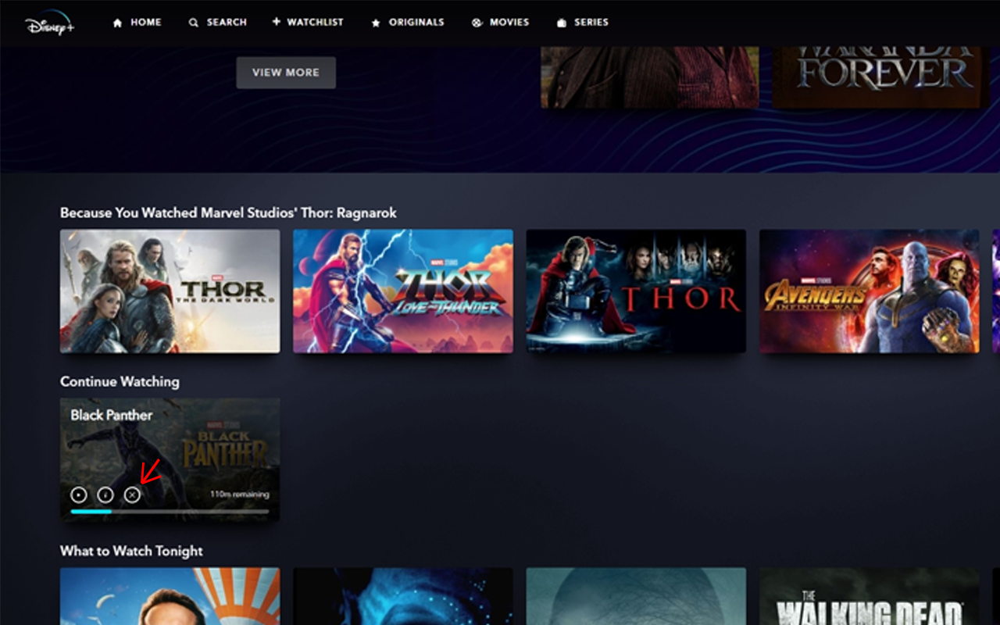

# Extended Continue Watching Extension
This chrome extension adds extra functionality to the continue watching section of streaming services.

## Installation
### Chrome Web Store
Coming soon.
### Manual
1. Download the latest release from the [releases page](https://github.com/krunder/continue-watching-extension/releases)
2. Unzip the file
3. Open chrome://extensions
4. Enable developer mode
5. Click "Load unpacked"
6. Select the unzipped folder
7. Refresh the page you want to use the extension on

## Supported Services
### Disney+
An additional button has been added to the continue watching section that can be used to
remove the movie/show from the list.

## Development
### Setup
1. Clone the repository
2. Run `npm install`
3. Run `npm run dev`

### Testing
Follow the manual installation instructions above, but upload the `dist` folder instead.
